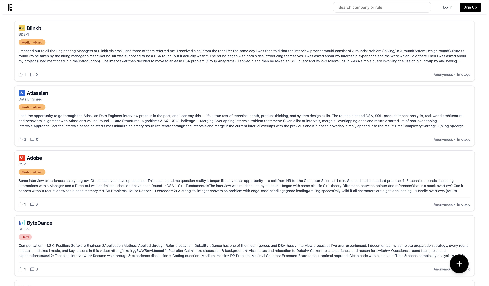
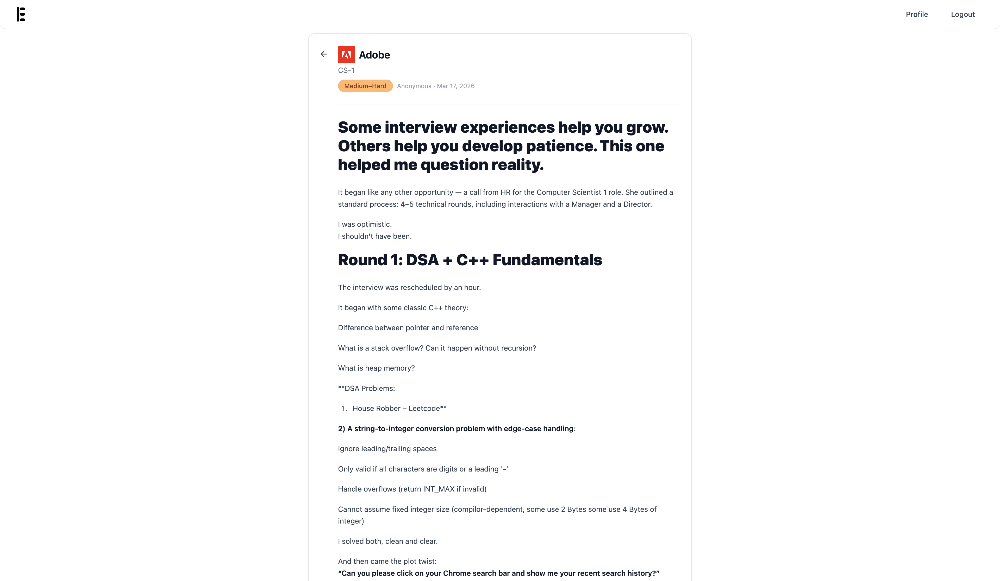

# Interview Experiences - Frontend Architecture

This repository contains the frontend for the **Interview Experiences** platform, designed to provide a highly responsive, secure, and modern user interface for sharing and reading interview experiences.

## Technical Architecture

The frontend is built using **React** and **Vite**, focusing on performance, modularity, and maintainability.

### Key Architectural Decisions

- **Feature-Based Structure**: The codebase follows a feature-sliced approach (e.g., `features/auth`, `features/posts`, `features/user`). This encapsulates components, hooks, and types related to a specific domain, making the codebase scalable as features grow.
- **State Management & Data Fetching**: 
  - Global state (like authentication) is managed via **React Context**.
  - **Axios Interceptors** are configured for automatic JWT token injection and unified error handling.
- **Rich Text & Security (XSS Prevention)**: 
  - The application uses **Tiptap** (a headless rich text editor) allowing users to craft detailed experiences with custom formatting.
  - Content is rigorously sanitized on the client side using **DOMPurify** before rendering, preventing any Cross-Site Scripting (XSS) vulnerabilities when displaying user-generated HTML.
- **Styling**: **Tailwind CSS v4** provides a utility-first design system, enabling rapid UI iteration while keeping bundle sizes small.

## Directory Structure

```text
src/
├── components/   # Shared UI components (Buttons, Inputs, Modals)
├── context/      # Global React Context providers (AuthContext)
├── features/     # Feature-sliced modules (auth, posts, user)
├── pages/        # Top-level route components
├── routes/       # Application routing logic (React Router DOM)
├── services/     # API client functions and Axios configuration
├── types/        # Global TypeScript interfaces
└── utils/        # Helper functions and constants
```

## Setup & Scripts

Ensure Node.js (v18+) is installed.

```bash
# Install dependencies
npm install

# Start the Vite development server (HMR enabled)
npm run dev

# Build the application for production
npm run build
```

**Environment Variables:**
Requires `.env.development` / `.env.production` to define backend targets, e.g., `VITE_API_BASE_URL`.

## UI Preview




